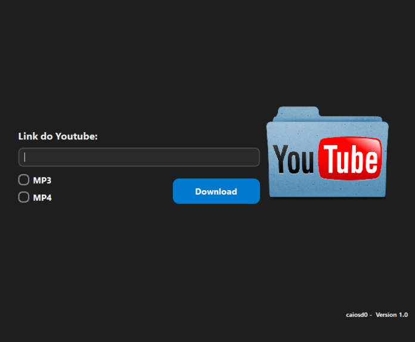

# 📥 YouTube Downloader com PyQt5 e yt-dlp



Este projeto é um **aplicativo simples** de download de vídeos ou músicas do YouTube, com uma interface gráfica feita em **PyQt5** e utilizando a biblioteca `yt-dlp`. Ele foi criado com o objetivo de **estudo e testes práticos** sobre integração de bibliotecas com interfaces gráficas.

> ⚠️ Este projeto é para **uso educacional** apenas. Não recomendo utilizar para fins comerciais ou para baixar conteúdos protegidos por direitos autorais.

---

## 🛠️ Tecnologias Utilizadas

- 🐍 **Python 3**
- 🖼️ **PyQt5** – para a interface gráfica.
- 📥 **yt-dlp** – ferramenta de download de vídeos e áudios.

---

## 🎨 Funcionalidades

- Campo para colar o link do YouTube.
- Botão de download..
- Escolha entre formatos:
  - 🎵 MP3 (áudio)
  - 🎬 MP4 (vídeo)

---

## 🚀 Como Executar

1. **Clone o repositório:**

```bash
git clone https://github.com/Caiosd0/youtube-downloader-pyqt.git
cd youtube-downloader-pyq
```

2. **Instale as dependências:**

```bash
pip install pyqt5 yt-dlp
```

3. **Execute o aplicativo:**

```bash
python nome_do_arquivo.py 

// Substitua nome_do_arquivo.py pelo nome do arquivo com o código principal.
```

## 📁 Saída dos Arquivos

Todos os arquivos baixados são salvos automaticamente na pasta **Musicas/** (ela será criada caso não exista).

## 📚 Propósito Educacional
Este projeto foi desenvolvido com os seguintes objetivos:

- Explorar o uso da biblioteca yt-dlp para download de mídia.

- Praticar o desenvolvimento de interfaces com PyQt5.

- Aplicar conceitos de eventos, design moderno e integração de funções em Python.